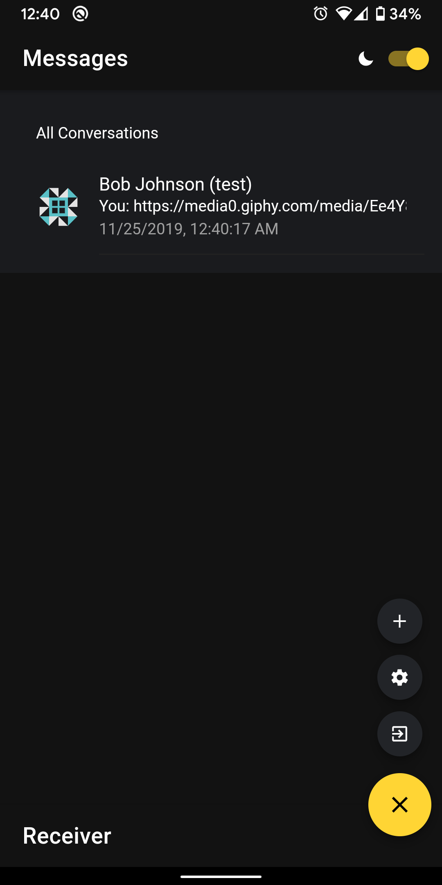

# Receiver

Receiver is a messaging app that allows users to message another individual with an account. The app allows users to use a variety of messaging plugins (GIPHY, dad jokes, translate, location, etc - more plugins + features will be added as development goes along). 

This is project for me to understand how the foundations of a simple chat works and the usage of Ionic as a Hybrid app. Additionally, to gain more experience working with Typescript, Angular and __[Reactive JavaScript](https://rxjs-dev.firebaseapp.com/)__ (Observables).

## Screenshot


## APIs Used
- __[Firebase API](https://firebase.google.com/docs/reference/js)__ - Realtime updates and storage for users, messages
- __[GIPHY API](https://developers.giphy.com/)__ - Gets a random GIF based on a search term
- __[Dad Jokes API](https://icanhazdadjoke.com/)__ - Generates a random dad joke
- __[Google Translate API](https://cloud.google.com/translate/docs/)__ -  Used to translate texts to another language
- __[Google Geocoding API](https://developers.google.com/maps/documentation/geocoding/start)__ - Used to access the address based on user's location
- __[Jdenticon](https://jdenticon.com/#icon-)__ - Generates unique profile icons
- __[Simple Crypto JS](https://www.npmjs.com/package/simple-crypto-js)__ - Salting + Hashing passwords and messages

## Cordova Plugins
Refer to `package.json` for the whole list, but "big" ones used are:
- __[Cordova Geolocation Plugin](https://cordova.apache.org/docs/en/latest/reference/cordova-plugin-geolocation/)__
- __[Cordova Local Notification Plugin](https://github.com/katzer/cordova-plugin-local-notifications)__

## Installation and Usage
### Requirements:
- Npm
- Ionic
- Cordova
- Java + Android SDK

### Browser
```
ionic serve
```

### Android
```
ionic cordova run android
```

### TODO
- Encrypt messages
- File upload
- iOS testing

